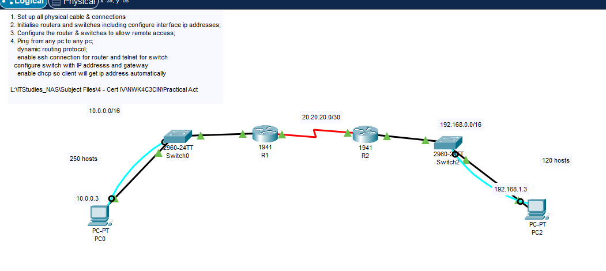

# Packet Tracer Network Routing Lab

A complete Cisco Packet Tracer lab solution for a small routed network with two LANs, router-to-router connectivity, dynamic routing, DHCP, SSH, Telnet, switch management IP addresses, and end-to-end PC connectivity.

## Author

**Toan Nguyen IT OZ**  
Adelaide, South Australia  
Email: toannguyenitoz@gmail.com

## Lab Requirements

This repository provides a full configuration solution for the following tasks:

1. Set up all physical cables and connections.
2. Initialise routers and switches.
3. Configure interface IP addresses.
4. Configure remote access:
   - SSH for routers
   - Telnet for switches
5. Configure switch management IP addresses and default gateways.
6. Configure DHCP so PCs receive IP addresses automatically.
7. Configure dynamic routing protocol.
8. Verify that any PC can ping any other PC.

## Topology



## Addressing Plan

| Device | Interface | IP Address | Subnet Mask | Purpose |
|---|---|---:|---:|---|
| R1 | G0/0 | 10.0.0.1 | 255.255.0.0 | Left LAN gateway |
| R1 | S0/0/0 | 20.20.20.1 | 255.255.255.252 | Link to R2 |
| R2 | S0/0/0 | 20.20.20.2 | 255.255.255.252 | Link to R1 |
| R2 | G0/0 | 192.168.1.1 | 255.255.0.0 | Right LAN gateway |
| Switch0 | VLAN 1 | 10.0.0.2 | 255.255.0.0 | Switch management |
| Switch2 | VLAN 1 | 192.168.1.2 | 255.255.0.0 | Switch management |
| PC0 | DHCP | 10.0.0.3 expected | 255.255.0.0 | Left LAN client |
| PC2 | DHCP | 192.168.1.3 expected | 255.255.0.0 | Right LAN client |


## IP Address Planning

This repository includes a detailed subnetting and IP address planning document:

```text
SUBNETTING_PLAN.md
```

The subnetting plan explains how to calculate the required subnet size from:

- Network IP / prefix
- Required number of hosts
- Subnet mask
- Usable host range
- Broadcast address
- Final device IP assignment

Recommended VLSM design:

| Segment | Required Hosts | Recommended Subnet | Usable Hosts |
|---|---:|---:|---:|
| Left LAN | 250 | 10.0.0.0/24 | 254 |
| WAN Link | 2 | 20.20.20.0/30 | 2 |
| Right LAN | 120 | 192.168.1.0/25 | 126 |

> Note: The original topology shows `/16` for the two LANs. This repository documents both the topology-based addressing and the optimised VLSM design.

## Dynamic Routing Protocol

This solution uses **OSPF single area 0**.

OSPF was selected because it is a common dynamic routing protocol used in enterprise networking labs and is more scalable than RIP.

## DHCP Design

DHCP is configured on the routers.

- R1 provides DHCP for the left LAN.
- R2 provides DHCP for the right LAN.

The DHCP excluded addresses are configured so the first PC lease should match the labels in the topology:

- PC0: `10.0.0.3`
- PC2: `192.168.1.3`

## Remote Access Design

| Device Type | Remote Access | Notes |
|---|---|---|
| Routers | SSH | Uses local username and RSA keys |
| Switches | Telnet | Simple lab requirement for switch remote access |

## Default Lab Credentials

| Purpose | Username | Password |
|---|---|---|
| Router SSH | admin | Admin@123 |
| Enable secret | N/A | class |
| Switch Telnet | N/A | cisco |
| Console line | N/A | cisco |

> These are lab-only passwords. Do not use them in production.

## Repository Structure

```text
packet-tracer-network-routing-lab/
├── README.md
├── LAB_STEPS.md
├── IP_ADDRESSING_TABLE.md
├── SUBNETTING_PLAN.md
├── LINKEDIN_POST.md
├── LICENSE
├── .gitignore
├── configs/
│   ├── R1-config.txt
│   ├── R2-config.txt
│   ├── Switch0-config.txt
│   └── Switch2-config.txt
├── docs/
│   └── topology.png
└── verification/
    └── verification-commands.md
```

## How to Use

1. Build the topology in Cisco Packet Tracer.
2. Cable the devices.
3. Configure the PCs to use DHCP.
4. Copy and paste the configuration files into each device CLI.
5. Run the verification commands.

## Interface Note

Cisco Packet Tracer interface names may vary depending on the router module used.

If your router uses a different serial interface, adjust the configuration accordingly, for example:

```text
Serial0/0/0
Serial0/0/1
Serial0/1/0
```

## Expected Result

After configuration:

- PC0 should receive an IP address from R1 DHCP.
- PC2 should receive an IP address from R2 DHCP.
- R1 and R2 should become OSPF neighbours.
- PC0 should successfully ping PC2.
- Routers should allow SSH access.
- Switches should allow Telnet access.
